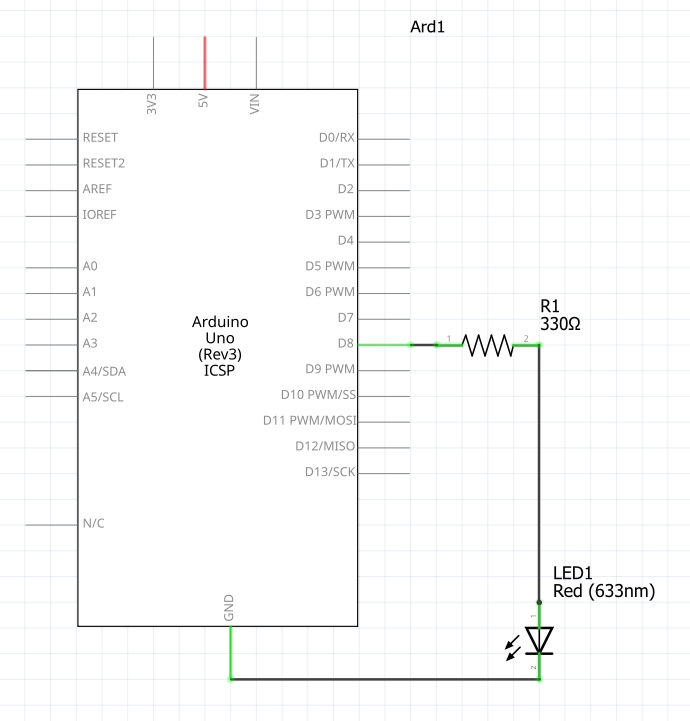
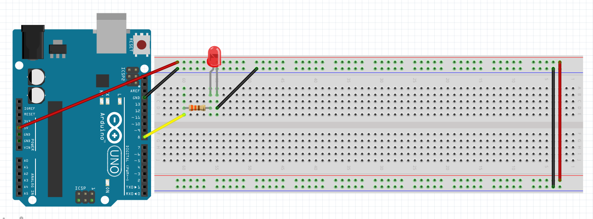

# Tutorial: Blinking an External LED

In our previous tutorial, we blinked the LED built into the Arduino board. Now, it is time to build a real circuit on a breadboard and control an external LED. This will combine our knowledge of breadboard prototyping and Arduino coding.

## Objectives
* Review LED polarity and the purpose of current-limiting resistors.
* Wire an external LED and resistor to an Arduino.
* Understand how to define and use variables for pin numbers in code.
* Control a specific digital pin to turn a physical component on and off.

## Materials Needed
* 1x Arduino Board
* 1x Breadboard
* 1x 5mm LED
* 1x 330 Ohm Resistor
* 2x Jumper Wires
* 1x USB Cable

## Component Review

Before we build the circuit, let's review two critical concepts about the components we are using.

### 1. LED Polarity
LED stands for Light Emitting Diode. A diode is a component that only allows electricity to flow in one direction. Because of this, LEDs are polarized, meaning they have a positive and a negative side. If you plug an LED in backwards, it will not light up.
* **Anode (+):** The positive side. This is the longer metal leg. It connects to your power source (in this case, the Arduino digital pin).
* **Cathode (-):** The negative side. This is the shorter metal leg, and there is usually a flat spot on the plastic base of the LED right above it. It connects to Ground (GND).

### 2. Why Do We Need a Resistor?
LEDs are very sensitive components. If you connect an LED directly to a power source like the 5V output of an Arduino without any protection, it will draw too much electrical current, overheat, and instantly burn out (sometimes with a small pop!). 
To prevent this, we add a resistor to the circuit. The resistor limits the flow of electricity, ensuring the LED gets just enough power to light up brightly without destroying itself. This is known as a "current-limiting resistor." For a standard 5V Arduino circuit, a 220 Ohm or 330 Ohm resistor is perfect.

## Circuit Diagrams

Here are the visual references for building this circuit. Use the wiring diagram to see the physical layout on the breadboard, and use the schematic to understand the electrical flow.

### Schematic Diagram


### Wiring Diagram


## Hardware Setup
1. Place the LED on your breadboard. Remember that the long leg is the Anode (positive) and the short leg is the Cathode (negative).
2. Connect one end of the 330 Ohm resistor to the row containing the LED's Anode. Connect the other end of the resistor to an empty row.
3. Use a jumper wire to connect that empty row (with the resistor) to **Digital Pin 8** on the Arduino.
4. Use another jumper wire to connect the row containing the LED's Cathode to one of the **GND (Ground)** pins on the Breadboard.

## The Code
Open the Arduino IDE, delete any existing code, and copy the following into the editor:

```cpp
// Create a variable to store the pin number we are using
// Make it a constant so that it does not change 
const int ledPin = 8;

void setup() {
  // Configure pin 8 as an output
  pinMode(ledPin, OUTPUT);
}

void loop() {
  digitalWrite(ledPin, HIGH);   // Turn the LED on (5V)
  delay(1000);                  // Wait for 1 second
  digitalWrite(ledPin, LOW);    // Turn the LED off (0V)
  delay(1000);                  // Wait for 1 second
}
```

## Understanding the Code

### Variables
At the very top of the sketch, before `setup()`, we added: `int ledPin = 8;`
* **const**: Makes this variable a **constant**.  It can never be changed once it's declared.
* **`int`**: Stands for integer. It tells the Arduino we are storing a whole number.
* **`ledPin`**: This is the name we chose for our variable. We could have named it anything, but giving it a descriptive name makes the code easier to read.
* **`= 8`**: We assign the value 8 to this variable because we plugged our wire into Digital Pin 8. 

Now, anywhere in the code where we type `ledPin`, the Arduino reads it as the number 8. If you ever move your wire to Pin 10, you only have to change the number at the top of your code, rather than searching through the whole program to replace every 8 with a 10!

### Output and Control
The rest of the code works exactly like our previous lesson:
* `pinMode(ledPin, OUTPUT)` sets Pin 8 to output power.
* `digitalWrite(ledPin, HIGH)` sends 5 Volts out of Pin 8, through the wire, through the resistor, through the LED, and back to Ground, completing the circuit and lighting the bulb.

## Uploading the Code
1. Connect your Arduino to your computer.
2. Verify your Board and Port are selected in the Tools menu.
3. Click the Upload button. 
4. Once it says "Done uploading," your external LED should begin blinking!