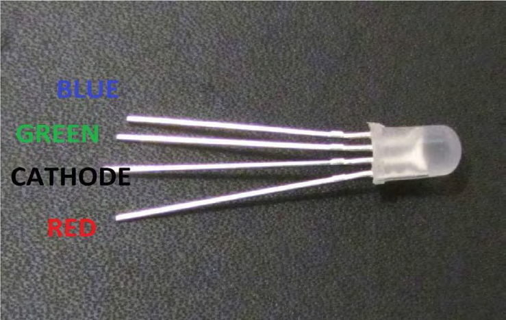
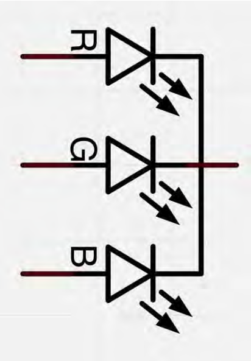
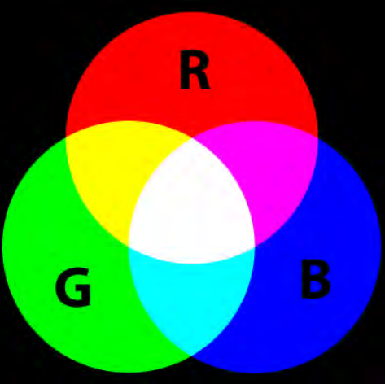
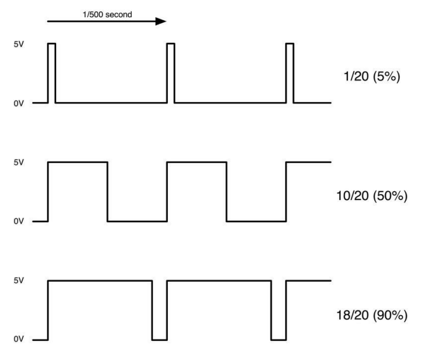
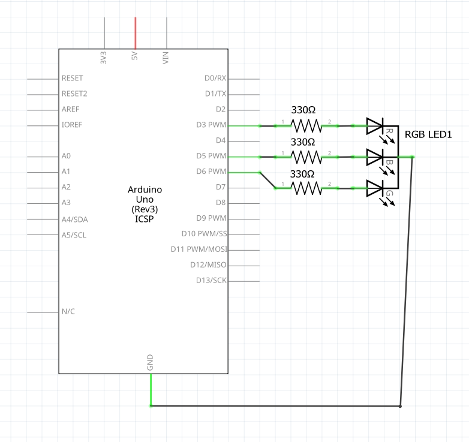
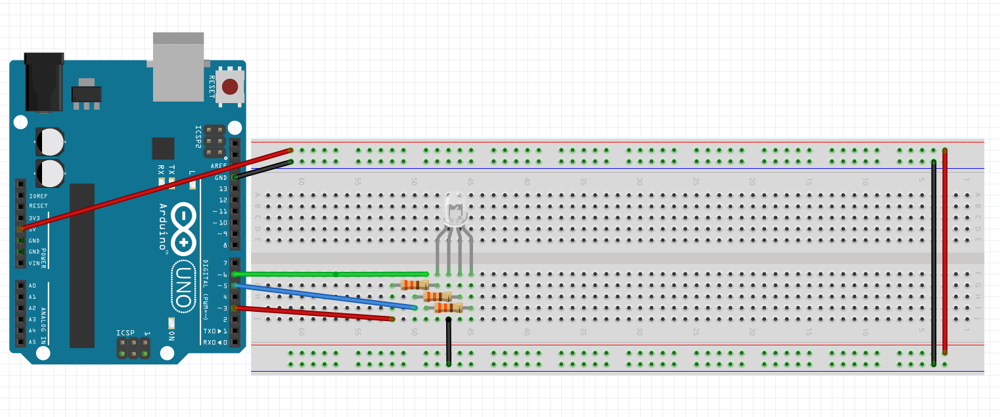

# Tutorial: Title
RGB LEDs are a fun and easy way to add some color to your projects. Since they are like 3 regular LEDs in one, how to use and connect them is not much different.
They come mostly in 2 versions: Common Anode or Common Cathode.
Common Anode uses 5V on the common pin, while Common Cathode connects to ground.
As with any LED, we need to connect some resistors in-line (3 total) so we can limit the current being drawn.
In our sketch, we will start with the LED in the Red color state, then fade to Green, then fade to Blue and finally back to the Red color. By doing this we will cycle through most of the color that can be achieved. 

## Objectives
* Learn about PWM
* Learn how to use an RGB Led

## Materials Needed
* 1x Arduino Board
* 1x Breadboard
* 1x USB Cable
* Wires
* 3x RGB LED
* 1x 330 Ohm Resistor
 

## Component Review
### RGB
At first glance, RGB (Red, Green and Blue) LEDs look just like regular LEDs. However, inside the usual LED package, there are actually three LEDs, one red, one green and yes, one blue. By controlling the brightness of each of the individual LEDs you can mix pretty much any color you want.
We mix colors the same way you would mix paint on a palette - by adjusting the
brightness of each of the three LEDs. The hard way to do this would be to use
different value resistors (or variable resistors) as we did with in Lesson 2, but that's a lot of work! Fortunately for us, UNO R3 board has an analogWrite function that you can use with pins marked with a ~ to output a variable amount of power to the appropriate LEDs.
The RGB LED has four leads. There is one lead going to the positive connection of each of the single LEDs within the package and a single lead that is connected to all three negative sides of the LEDs.



Here on the photographs you can see 4 electrode LED. Every separate pin for Green or Blue or Red color is called Anode. You will always connect “+” to it. Cathode goes to “-“(ground). If you connect it other way round the LED will not light. The common negative connection of the LED package is the second pin from the flat side. It is also the longest of the four leads and will be connected to the ground. Each LED inside the package requires its own 220Ω resistor to prevent too much current flowing through it. The three positive leads of the LEDs (one red, one green and one blue) are connected to UNO output pins using these resistors. 



### Color
The reason that you can mix any color you like by varying the quantities of red, green and blue light is that your eye has three types of light receptor in it (red, green and blue). Your eye and brain process the amounts of red, green and blue and convert it into a color of the spectrum.
In a way, by using the three LEDs, we are playing a trick on the eye. This same idea is used in TVs, where the LCD has red, green and blue color dots next to each other making up each pixel. 



If we set the brightness of all three LEDs to be the same, then the overall color of the light will be white. If we turn off the blue LED, so that just the red and green LEDs are the same brightness, then the light will appear yellow. We can control the brightness of each of the red, green and blue parts of the LED separately, making it possible to mix any color we like.
Black is not so much a color as an absence of light. Therefore, the closest we can come to black with our LED is to turn off all three colors. 

### PWM
Pulse Width Modulation (PWM) is a technique for controlling power.
We also use it here to control the brightness of each of the LEDs.
The diagram below shows the signal from one of the PWM pins on the UNO. 



Roughly every 1/500 of a second, the PWM output will produce a pulse. The length of this pulse is controlled by the `analogWrite` function. So `analogWrite(0)` will not
produce any pulse at all and `analogWrite(255)` will produce a pulse that lasts all the
way until the next pulse is due, so that the output is actually on all the time.
If we specify a value in the analogWrite that is somewhere in between 0 and 255,
then we will produce a pulse. If the output pulse is only high for 5% of the time, then
whatever we are driving will only receive 5% of full power.
If, however, the output is at 5V for 90% of the time, then the load will get 90% of
the power delivered to it. We cannot see the LEDs turning on and off at that speed,
so to us, it just looks like the brightness is changing. 

## Circuit Diagrams

Here are the visual references for building this circuit. Use the wiring diagram to see the physical layout on the breadboard, and use the schematic to understand the electrical flow.

### Schematic Diagram


 
### Wiring Diagram



<!--
## Hardware Setup
1. 
2. 
-->


## The Code
Open the Arduino IDE, delete any existing code, and copy the following into the editor:

```cpp
// Define Pin Constants
const blueLED 3;
const greenLED 5;
const redLED 6;

// Define variables
int redValue;
int greenValue;
int blueValue;

int delayTime = 10;  // fading time between colors

//Runs once
void setup() {
  pinMode(redLED, OUTPUT);
  pinMode(greenLED, OUTPUT);
  pinMode(blueLED, OUTPUT);
  digitalWrite(redLED, HIGH);
  digitalWrite(greenLED, LOW);
  digitalWrite(blueLED, LOW);
}

//Runs over and over
void loop() {
  redValue = 255;  // choose a value between 1 and 255 to change the color.
  greenValue = 0;
  blueValue = 0;

  for (int i = 0; i < 255; i += 1)  // fades out redLED bring greenLED full when i=255
  {
    redValue -= 1;
    greenValue += 1;
    analogWrite(redLED, redValue);
    analogWrite(greenLED, greenValue);
    delay(delayTime);
  }

  redValue = 0;
  greenValue = 255;
  blueValue = 0;

  for (int i = 0; i < 255; i += 1)  // fades out greenLED bring blueLED full when i=255
  {
    greenValue -= 1;
    blueValue += 1;
    analogWrite(greenLED, greenValue);
    analogWrite(blueLED, blueValue);
    delay(delayTime);
  }

  redValue = 0;
  greenValue = 0;
  blueValue = 255;

  for (int i = 0; i < 255; i += 1)  // fades out blueLED bring redLED full when i=255
  {
    blueValue -= 1;
    redValue += 1;
    analogWrite(blueLED, blueValue);
    analogWrite(redLED, redValue);
    delay(delayTime);
  }
}
```

## Understanding the Code
This Arduino program is designed to create a smooth, continuous color-fading effect using an RGB (Red, Green, Blue) LED. 

The code above will use FOR loops to cycle through the colors.
* The first FOR loop will go from RED to GREEN.
* The second FOR loop will go from GREEN to BLUE.
* The last FOR loop will go from BLUE to RED.


### Variables and Pin Setup
* **Pin Assignments:** The program starts by defining the specific Arduino pins used for the LED. It assigns pin 3 to the blue LED, pin 5 to the green LED, and pin 6 to the red LED. These pins are declared to be constants as they should never change.
* **Fade Speed:** A `delayTime` variable is set to `10`, representing a 10-millisecond pause between brightness changes, which dictates how fast the colors fade.

### void setup()
* In the `setup()` block, the assigned pins are configured to send signals out (`OUTPUT`). 
* The program initializes the LED by turning the red light completely on (`HIGH`) while keeping the green and blue lights off (`LOW`).

### void loop()
The `loop()` function is where the fading animation happens. It relies on the `analogWrite()` function, which uses Pulse Width Modulation (PWM) to send values between `0` (completely off) and `255` (completely on) to adjust brightness. The loop is divided into three distinct phases:

* **Phase 1 (Red to Green):** A `for` loop gradually decreases the `redValue` while simultaneously increasing the `greenValue` by 1 at each step. This fades the red light out while bringing the green light to full brightness.
* **Phase 2 (Green to Blue):** A second `for` loop slowly decreases the `greenValue` back down to 0 while increasing the `blueValue` up to full brightness.
* **Phase 3 (Blue to Red):** A final `for` loop decreases the `blueValue` back to 0 while increasing the `redValue` back to 255. 

Each phase utilizes the `delayTime` to make the transition smooth to the human eye. Once Phase 3 finishes, the entire `loop()` starts over from the beginning, creating a never-ending, shifting rainbow effect.
