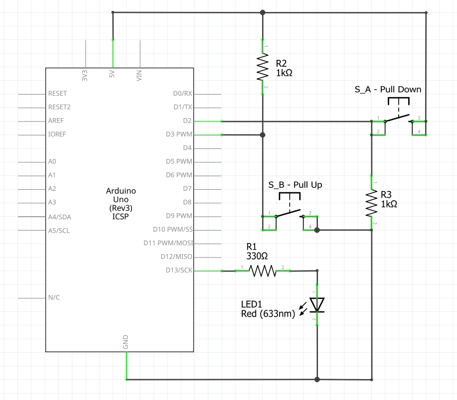
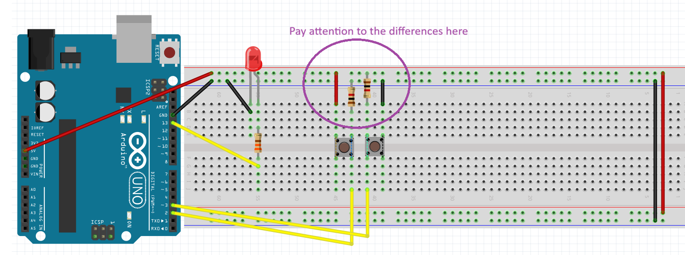

# Tutorial: Digital Inputs
In this lesson, you will learn to use push buttons with digital inputs to turn an LED
on and off.

Pressing the button will turn the LED on; pressing the other button will turn the LED
off.
Unlike a simple light switch, digital inputs in microcontrollers need to be "steered" to a specific voltage to avoid errors.

## Objectives
* Learn how to **push buttons** (Momentary Tactile Switches) work
* Learn the difference between **Pull-Up** and **Pull-Down** resistors.
* Practice using `digitalRead()` and `if/else` logic in code.

## Materials Needed
* 1x Arduino Board
* 1x USB Cable
* 1x Breadboard
* 1x 5mm LED
* 1x 330 Ω Resistor
* 2x push button switches
* 2x 1 kΩ Resistor
* Jumper Wires


### The Push Button
A tactile push button has four pins. Internally, the pins are connected in pairs. When you press the button, it completes the circuit across all four pins. 

### Why use Pull-Up/Pull-Down Resistors?
Microcontroller pins are very sensitive. If a pin isn't connected to anything (called a **Floating Pin**), it will act like an antenna, picking up static electricity and randomly flipping between `HIGH` and `LOW`. 

* **Pull-Down Resistor:** Connects the pin to **GND** through a resistor. The pin stays `LOW` until you press the button to connect it to `5V`.
* **Pull-Up Resistor:** Connects the pin to **5V** through a resistor. The pin stays `HIGH` until you press the button to connect it to `GND`.


## Circuit Diagrams

Here are the visual references for building this circuit. Use the wiring diagram to see the physical layout on the breadboard, and use the schematic to understand the electrical flow.

### Schematic Diagram
Note how Pin 2 is tied to Ground (Pull-Down) and Pin 3 is tied to 5V (Pull-Up).


### Wiring Diagram


## Hardware Setup Notes
1.  **Button A (Pull-Down):**
    * Place the button across the breadboard center gap.
    * Connect one side to **5V**.
    * Connect the other side to Arduino **Pin 2**.
    * Add a **1 kΩ** resistor from that same side of the button to **GND**.
2.  **Button B (Pull-Up):**
    * Place the second button.
    * Connect one side to **GND**.
    * Connect the other side to Arduino **Pin 3**.
    * Add a **1 kΩ** resistor from that same side of the button to **5V**.


## The Code
Open your Arduino IDE and upload the following code:

```cpp
/*
 * TEJ Tutorial: Pull-Up vs Pull-Down
 * This code turns an LED on with one button logic 
 * and off with another.
 */

const int ledPin = 13;      // Onboard LED
const int btnOn = 2;        // Pull-down button
const int btnOff = 3;       // Pull-up button

void setup() {
  pinMode(ledPin, OUTPUT);
  pinMode(btnOn, INPUT);
  pinMode(btnOff, INPUT);
}

void loop() {
  // Read the state of the buttons
  int onState = digitalRead(btnOn);
  int offState = digitalRead(btnOff);

  // Button A (Pull-down) is HIGH when pressed
  if (onState == HIGH) {
    digitalWrite(ledPin, HIGH);
  }

  // Button B (Pull-up) is LOW when pressed
  if (offState == LOW) {
    digitalWrite(ledPin, LOW);
  }
}
```

## Understanding the Code
### Variables
We use `const int` to name our pins. This makes the code easier to read. `btnOn` is Pin 2, and `btnOff` is Pin 3.

### digitalRead()
This function checks the voltage at a specific pin.
* If it detects 5V, it returns HIGH.
* If it detects 0V (GND), it returns LOW.

### Button Logic Flip
* For Button A: Because it uses a ***Pull-Down*** resistor, its natural state is `LOW`. When we press it, it connects to 5V, so we check for if `(onState == HIGH)`.
* For Button B: Because it uses a ***Pull-Up*** resistor, its natural state is HIGH. When we press it, it connects to Ground, so we check for `if (offState == LOW)`.
