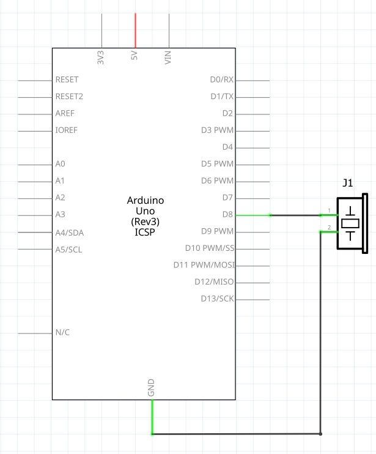

# Lesson: Active Buzzer

## Objective
In this lesson, you will learn how to connect an active buzzer to an Arduino UNO and write a simple program to make it beep.

## Materials Needed
* 1x Arduino Board
* 1x USB Cable
*    Jumper Wires
* 1x Breadboard
* 1x Active Buzzer (Warning - looks very similar to a passive buzzer)


## Circuit Diagrams
An **active buzzer** is very simple to use because it has its own internal oscillator. This means it generates sound automatically as soon as it receives direct current (DC) power.

**Connections:**
1.  Connect the **Positive pin** (usually marked with a '+' or the longer leg) to **Digital Pin 8** on the Arduino.
2.  Connect the **Negative pin** (the shorter leg or marked with '-') to any **GND (Ground)** pin on the Arduino.

### Schematic Diagram


### Wiring Diagram


## The Program
Copy and paste the following C++ code into your Arduino IDE, then compile and upload it to your board.

```cpp
// Define the pin connected to the active buzzer
const int buzzerPin = 8;

void setup() {
  // Configure the buzzer pin to behave as an OUTPUT
  pinMode(buzzerPin, OUTPUT);
}

void loop() {
  // Turn the buzzer ON by sending 5 Volts (HIGH)
  digitalWrite(buzzerPin, HIGH);
  delay(1000); // Wait for 1000 milliseconds (1 second)

  // Turn the buzzer OFF by sending 0 Volts (LOW)
  digitalWrite(buzzerPin, LOW);
  delay(1000); // Wait for 1 second before repeating the loop
}
```

## Understanding the Code
* `const int buzzerPin = 8;`: We create a variable to store the pin number, making it easier to reference and change later if needed.
* `pinMode(buzzerPin, OUTPUT);`: This tells the Arduino's microcontroller that we are going to send an electrical signal *out* of Pin 8 to control an external component.
* `digitalWrite(buzzerPin, HIGH);`: This commands the Arduino to output 5V to the buzzer. Because it is an *active* buzzer, simply providing it with power triggers its internal oscillator to produce a loud, continuous tone.
* `digitalWrite(buzzerPin, LOW);`: This stops the power output (drops to 0V), turning the buzzer sound off.
* `delay(1000);`: This function pauses the execution of the program for the specified number of milliseconds, dictating the rhythm of the beeps.

## Make it sound different
You can make the buzzer emit different frequencies by turning it on and off quickly.  

```cpp

const int buzzer = 8;  //the pin of the active buzzer

void setup() {
  pinMode(buzzer, OUTPUT);  //initialize the buzzer pin as an output
}
void loop() {
  //output an frequency
  for (int i = 0; i < 80; i++) {
    digitalWrite(buzzer, HIGH);
    delay(1);  //wait for 1ms
    digitalWrite(buzzer, LOW);
    delay(1);  //wait for 1ms
  }
  
  //output another frequency
  for (int i = 0; i < 100; i++) {
    digitalWrite(buzzer, HIGH);
    delay(2);  //wait for 2ms
    digitalWrite(buzzer, LOW);
    delay(2);  //wait for 2ms
  }
}
```

