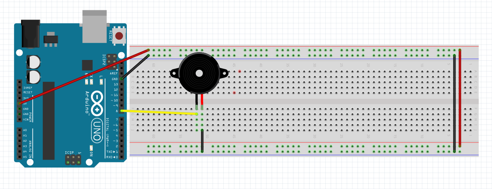

# Lesson: Passive Buzzer

## Objective
In this lesson, you will learn how to connect a passive buzzer to an Arduino UNO and use the `tone()` function to play a sequence of different musical notes.

> **Important Note:** In our previous lesson, we used an **active buzzer**. Active buzzers have a built-in oscillator, meaning they are designed to play only *one fixed tone* when you turn them on. To play *different* pitches and create melodies, we need to swap it out for a **passive buzzer**. A passive buzzer acts more like a tiny speaker—it requires the Arduino to send it a rapidly pulsing signal (frequency) to generate specific musical notes.

## Materials Needed
* 1x Arduino Board
* 1x USB Cable
*    Jumper Wires
* 1x Breadboard
* 1x **Passive** Buzzer (Warning - looks very similar to an active buzzer)


## Circuit Diagrams
The wiring for a passive buzzer is identical to an active buzzer. 

**Connections:**
1.  Connect the **Positive pin** (usually marked with a '+' or the longer leg) to **Digital Pin 8** on the Arduino.
2.  Connect the **Negative pin** (the shorter leg or marked with '-') to any **GND (Ground)** pin on the Arduino.

### Schematic Diagram


### Wiring Diagram



## The Program
To make different notes, we use specific frequencies (measured in Hertz). For example, Middle C is 262 Hz, D is 294 Hz, and E is 330 Hz. Copy and paste the following code into your Arduino IDE.

```cpp
// Define the pin connected to the passive buzzer
const int buzzerPin = 8;

void setup() {
  // The tone() function automatically sets the pin as an output, 
  // so we actually don't strictly need anything here, but it's 
  // good practice to leave it with an empty setup for this simple sketch.
}

void loop() {
  // Play Middle C (262 Hz) for 300 milliseconds
  tone(buzzerPin, 262); 
  delay(300);
  
  // A short pause between notes so they don't blend together
  noTone(buzzerPin);
  delay(50);

  // Play D (294 Hz) for 300 milliseconds
  tone(buzzerPin, 294);
  delay(300);
  
  noTone(buzzerPin);
  delay(50);

  // Play E (330 Hz) for 300 milliseconds
  tone(buzzerPin, 330);
  delay(300);

  // Stop the tone and wait 2 seconds before playing the sequence again
  noTone(buzzerPin);
  delay(2000); 
}
```

## How It Works
* `tone(pin, frequency);`: This built-in Arduino function generates a square wave of the specified frequency (pitch) on a pin. 
    * The first number is the pin we are using (`buzzerPin` or 8).
    * The second number is the pitch in Hertz. Changing this number changes the note you hear.
* `noTone(pin);`: This function tells the Arduino to stop generating the sound wave. If you don't use `noTone()`, the buzzer will keep playing the last note forever.
* `delay(50);`: This creates a tiny sliver of silence between notes. Without it, the notes slur together and sound like one continuous, shifting beep.