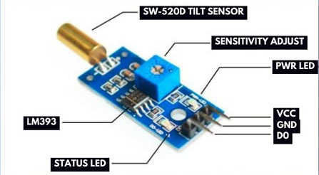

# Tutorial: Detecting Inclination with a Tilt Ball Switch

In this lesson, you will learn how to use a tilt ball switch in order to detect a small 
angle of inclination. We will also introduce the Serial Monitor to observe the sensor's real-time output.

## Objectives
* Learn how to use a ball tilt sensor.
* Learn how to use the serial monitor.

## Materials Needed
* 1x Arduino Board
* 1x USB Cable
* Jumper Wires
* 1x Breadboard
* 1x Ball Tilt Sensor


## Component Review

Tilt sensors (tilt ball switch) allow you to detect orientation or inclination. They are small, inexpensive, low-power and easy-to-use. If used properly, they will not wear out. Their simplicity makes them popular for toys, gadgets and appliances. Sometimes, they are referred to as "mercury switches", "tilt switches" or "rolling ball sensors". 

They are usually made up of a cavity of some sort (cylindrical is popular, although not always) with a conductive free mass inside, such as a blob of mercury or rolling ball. 

One end of the cavity has two conductive elements (poles). When the sensor is oriented so that that end is downwards, the mass rolls onto the poles and shorts them, acting as a switch throw. 

While not as precise or flexible as a full accelerometer, tilt switches can detect motion or orientation. Another benefit is that the big ones can switch power on their own. Accelerometers, on the other hand, output digital or analog voltage that must then be analyzed using extra circuitry.




## Circuit Diagrams

Here are the visual references for building this circuit. Use the wiring diagram to see the physical layout on the breadboard, and use the schematic to understand the electrical flow.
<!--
### Schematic Diagram


### Wiring Diagram

-->
## Hardware Setup
### Sensor Pins
* **Digital Out:** Connect `DO` to **Digital Pin 2** on the Arduino using a jumper wire.
* **Ground:** Connect the `GND` other leg of the tilt sensor to any **GND (Ground)**.
* **Voltage:** Connect the `VCC` pin to **5 Volts**.

### LED
**No External LED required:** We will be using the Arduino's built-in LED, which is internally wired to Digital Pin 13.

## The Code
Open the Arduino IDE, delete any existing code, and copy the following into the editor. We have updated the code to include Serial Monitor functionality so you can see the sensor's exact state:

```cpp
const int ledPin = 13;  // The pin the onboard LED is attached to
const int tiltPin = 2;  // The pin the tilt sensor is attached to

void setup()
{ 
  pinMode(ledPin, OUTPUT); // Initialize the ledPin as an output
  
  // Initialize the tilt pin as an input and turn on the internal pull-up resistor
  pinMode(tiltPin, INPUT_PULLUP);
  
  // Initialize serial communication at 9600 bits per second
  Serial.begin(9600);
} 

void loop() 
{  
  // Read the state of the tilt sensor
  int digitalVal = digitalRead(tiltPin);
  Serial.println("Read Value: " + digitalVal);

  
  // If the switch is open (un-tilted), the pull-up resistor makes it HIGH
  if(digitalVal == HIGH)
  {
    digitalWrite(ledPin, LOW); // Turn the LED off
    Serial.println("State: HIGH (Switch Open / Upright)");
  }
  // If the switch is closed (tilted), the connection to GND makes it LOW
  else
  {
    digitalWrite(ledPin, HIGH); // Turn the LED on 
    Serial.println("State: LOW (Switch Closed / Tilted)");
  }
  
  // A short delay so the Serial Monitor output is readable
  delay(250); 
}
```

## Understanding the Code

* `Serial.begin(9600);`: This command in the `setup()` block opens a communication channel between the Arduino and your computer at a speed of 9600 baud. To see the output, you must open the Serial Monitor in the Arduino IDE (magnifying glass icon in the top right) and ensure the baud rate drop-down is set to 9600.
* `pinMode(tiltPin, INPUT_PULLUP);`: This single command configures Pin 2 as an input while simultaneously activating the Arduino's internal "pull-up resistor". This is much cleaner than the older method of using `INPUT` followed by a `digitalWrite HIGH`. It ensures the pin reads a steady `HIGH` (5V) when the tilt switch is open, preventing the pin from "floating" and picking up random electrical noise.
* `digitalRead(tiltPin);`: This function checks the electrical state of Pin 2. 
* `if/else` Logic: 
  * When the sensor is upright, the metal ball rolls away from the contacts. The circuit is open, so `digitalRead` detects the `HIGH` state from the pull-up resistor. The code responds by turning the LED off and printing "HIGH" to the Serial Monitor.
  * When tilted, the ball bridges the contacts, connecting Pin 2 directly to Ground. The voltage drops, `digitalRead` detects `LOW`, and the code turns the LED on while printing "LOW" to the Serial Monitor.
* `Serial.println(...);`: This function pushes text data through the USB cable to your computer's Serial Monitor, adding a new line after every message so the data forms a neat vertical list.