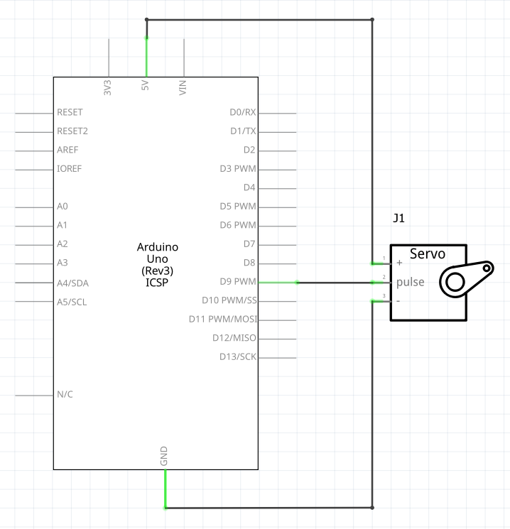

# Tutorial: Controlling Micro Servo Motor

In this lesson, you will learn how to connect and control an SG90 micro servo motor using your Arduino. We will use the built-in Arduino Servo library to sweep the motor arm back and forth.

## Objectives
* Learn how a servo motor works and how it differs from a standard DC motor.
* Understand the wiring and signal requirements for the SG90 servo.
* Learn how to use the `#include <Servo.h>` library to control the motor's position.

## Materials Needed
* 1x Arduino Board
* 1x USB Cable
* Jumper Wires
* 1x SG90 Micro Servo Motor

## Component Review

A **servo motor** is a rotary actuator that allows for precise control of angular position. Unlike a standard DC motor that simply spins continuously when power is applied, a standard hobby servo is commanded to rotate to a specific angle (usually between 0 and 180 degrees) and hold that position. 

Internally, a servo consists of a small DC motor, a gearbox to reduce speed and increase torque, a potentiometer (variable resistor) attached to the output shaft to measure the current angle, and a small control circuit board. The control board reads the signal from the Arduino, compares the desired angle to the current angle read by the potentiometer, and powers the motor to correct the difference.


### SG90 Common Specifications
The SG90 is a common, inexpensive, and lightweight micro servo available for hobby electronics.
* **Weight:** xxxg 
* **Dimensions:** 3.2 cm x 3 cm x 1.2 cm
* **Operating Voltage:** 4.8V to 6.0V (Runs perfectly off the Arduino's 5V pin)
* **Stall Torque:** 1.6 kg-cm (at 4.8V) - *This means it can lift 1.6kg at a 1cm distance from the center of the shaft before stalling.*
* **Operating Speed:** 0.12 seconds / 60 degrees (at 4.8V)
* **Rotation Range:** Approximately 180 degrees.
* **Control System:** PWM (Pulse Width Modulation).


## Circuit Diagrams

Here are the visual references for building this circuit. Use the wiring diagram to see the physical layout on the breadboard, and use the schematic to understand the electrical flow.

### Schematic Diagram

<!--
### Wiring Diagram

-->
## Hardware Setup
The SG90 servo has a 3-wire female connector. You will use male-to-male jumper wires to connect it to the Arduino. 
1. **Ground:** Connect the **Brown** (or sometimes Black) wire to any **GND** pin on the Arduino.
2. **Power:** Connect the **Red** wire to the **5V** pin on the Arduino.
3. **Signal:** Connect the **Orange** (or sometimes Yellow) wire to **Digital Pin 9** on the Arduino. *(Note: The servo library takes over Timer 1 which is also used by PWM on pins 9 and 10.  Since PWM won't function on pins 9 or 10 when driving servos these pins are most commonly used as the servo pins.).*

## The Code
Open the Arduino IDE, delete any existing code, and copy the following into the editor:

```cpp
// Include the built-in Servo library
#include <Servo.h> 

// Create a servo object to control our SG90
Servo myServo;  

const int servoPin = 9; // The digital pin the servo signal wire is connected to
int angle = 0;          // Variable to store the current servo position

void setup() 
{ 
  // Attach the servo object to the specified pin
  myServo.attach(servoPin); 
} 

void loop() 
{  
  // Sweep from 0 degrees to 180 degrees
  for(angle = 0; angle <= 180; angle += 1) 
  {
    myServo.write(angle); // Tell servo to go to the position in variable 'angle'
    delay(15);            // Wait 15ms for the servo to reach the position
  }
  
  // Sweep from 180 degrees back to 0 degrees
  for(angle = 180; angle >= 0; angle -= 1) 
  {
    myServo.write(angle); 
    delay(15);            
  }
}
```

## Understanding the Code

* `#include <Servo.h>`: This tells the Arduino IDE to include a special library containing pre-written code specifically for controlling servos. It handles the complex, precise PWM timing required by the motor in the background so you don't have to.
* `Servo myServo;`: This line creates a "Servo object" named `myServo`. If you had multiple servos, you could create multiple objects (e.g., `Servo steeringServo;`, `Servo throttleServo;`).
* `myServo.attach(servoPin);`: Placed inside the `setup()` function, this tells the Arduino which digital pin the servo's signal wire is connected to.
* `for` loops: The first loop slowly increases the `angle` variable from 0 to 180, one degree at a time. The second loop decreases it from 180 back to 0.
* `myServo.write(angle);`: This is the core command used to control the servo. You simply pass it an integer between 0 and 180, and the servo moves to that physical angle. 
* `delay(15);`: Servos are physical, mechanical devices that take time to move. The 15-millisecond delay gives the motor enough time to actually rotate to the newly commanded degree before the loop repeats and gives it a new command. Without this delay, the code would run so fast the servo would just vibrate in place.