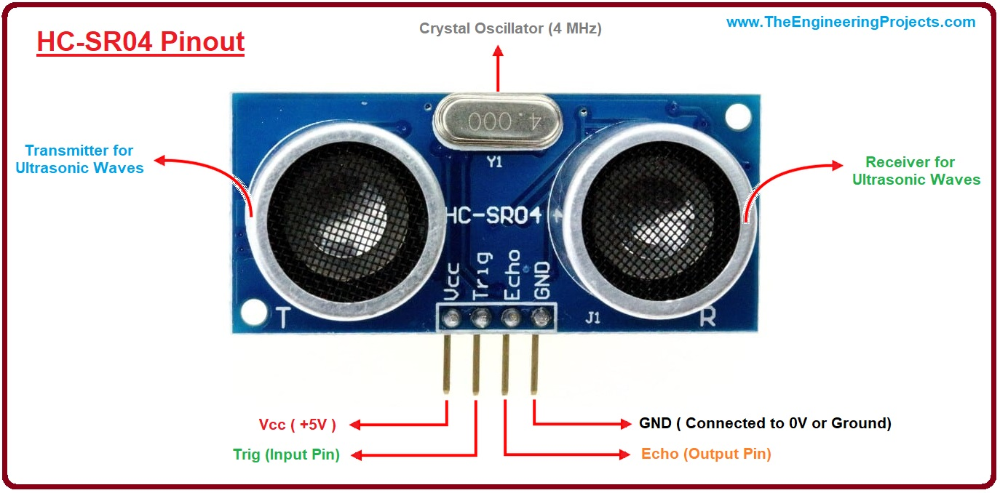

# Tutorial: HC-SR04 Ultrasonic Sensor

In this lesson, you will learn how to connect and program an HC-SR04 ultrasonic sensor to measure distances and display the results on your computer's Serial Monitor.

## Objectives
* Learn the principles of echolocation and how ultrasonic sensors work.
* Learn how to use the `pulseIn()` function to measure the duration of a signal.
* Learn how to convert time measurements into physical distance using the speed of sound.

## Materials Needed
* 1x Arduino Board
* 1x USB Cable
* Jumper Wires
* 1x Breadboard
* 1x HC-SR04 Ultrasonic Sensor

## Component Review

The HC-SR04 is an ultrasonic distance sensor. It determines distance in the exact same way that bats and dolphins do: through echolocation. 


The module features two prominent cylindrical components that look like "eyes." One is a transmitter, and the other is a receiver. 
* **Transmitter (Trig):** When triggered by the Arduino, this emits a high-frequency sound wave (ultrasound) that human ears cannot hear.
* **Receiver (Echo):** This "listens" for the sound wave to bounce off an object and return. 

By measuring the exact time it takes for the sound wave to travel out, hit an object, and bounce back to the receiver, the Arduino can calculate the distance to the object using the known speed of sound.




The sensor has four pins:
1.  **VCC:** Power supply (5V)
2.  **Trig:** Trigger pin (receives the command from Arduino to send the sound pulse)
3.  **Echo:** Echo pin (sends a signal back to the Arduino to report how long the sound took to return)
4.  **GND:** Ground

## Circuit Diagrams

Here are the visual references for building this circuit. Use the wiring diagram to see the physical layout on the breadboard, and use the schematic to understand the electrical flow.

### Schematic Diagram


### Wiring Diagram


## Hardware Setup
1. **Power & Ground:** Connect the **VCC** pin of the HC-SR04 to the **5V** pin on the Arduino. Connect the **GND** pin to a **GND** pin on the Arduino.
2. **Trigger:** Connect the **Trig** pin of the sensor to **Digital Pin 9** on the Arduino.
3. **Echo:** Connect the **Echo** pin of the sensor to **Digital Pin 10** on the Arduino.

## The Code
Open the Arduino IDE, delete any existing code, and copy the following into the editor:

```cpp
// Define the pins connected to the sensor
const int trigPin = 9;
const int echoPin = 10;

// Variables to hold the duration of the echo and the calculated distance
long duration;
int distance;

void setup() 
{
  // Configure the trigger pin as an output to send the pulse
  pinMode(trigPin, OUTPUT);
  // Configure the echo pin as an input to read the returning pulse
  pinMode(echoPin, INPUT);
  
  // Start serial communication to view results
  Serial.begin(9600);
}

void loop() 
{
  // 1. Clear the trigPin to ensure a clean pulse
  digitalWrite(trigPin, LOW);
  delayMicroseconds(2);

  // 2. Send a 10-microsecond HIGH pulse to trigger the sensor
  digitalWrite(trigPin, HIGH);
  delayMicroseconds(10);
  digitalWrite(trigPin, LOW);

  // 3. Read the echoPin. pulseIn() returns the duration of the pulse in microseconds
  duration = pulseIn(echoPin, HIGH);

  // 4. Calculate the distance (in centimeters)
  // Speed of sound is ~0.034 centimeters per microsecond
  // We divide by 2 because the sound travels out AND back
  distance = duration * 0.034 / 2;

  // 5. Print the result to the Serial Monitor
  Serial.println("Distance: " + String(distance) + " cm");

  // Wait a short moment before taking the next measurement
  delay(100);
}
```

## Understanding the Code

* `delayMicroseconds();`: Similar to the standard `delay()` function, but this pauses the code for incredibly short fractions of a millisecond. We use this to create the precise 10-microsecond pulse required to "wake up" the HC-SR04 and tell it to fire its sound wave.
* `pulseIn(pin, value);`: This is a very useful built-in Arduino function. When we call `pulseIn(echoPin, HIGH);`, the Arduino waits for the Echo pin to go `HIGH`, starts a stopwatch, and stops the stopwatch when the pin goes `LOW` again. It returns the total time elapsed in microseconds.
* `duration * 0.034 / 2`: * Sound travels through the air at approximately 340 meters per second, which converts to **0.034 centimeters per microsecond**.
    * If we multiply the time our pulse traveled (`duration`) by the speed of sound (`0.034`), we get the total distance the sound traveled.
    * Because the sound wave had to travel *to* the object and then bounce *back* to the sensor, the total distance is twice as far as the object actually is. Therefore, we divide the final number by **2** to get the true distance to the object!
* `String(distance)`: The variable `distance` is not a `String` so it needs to be converted first before it can be joined to other text.  It's always a good idea to **label** your ouput values.  