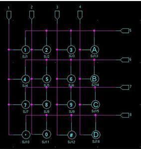
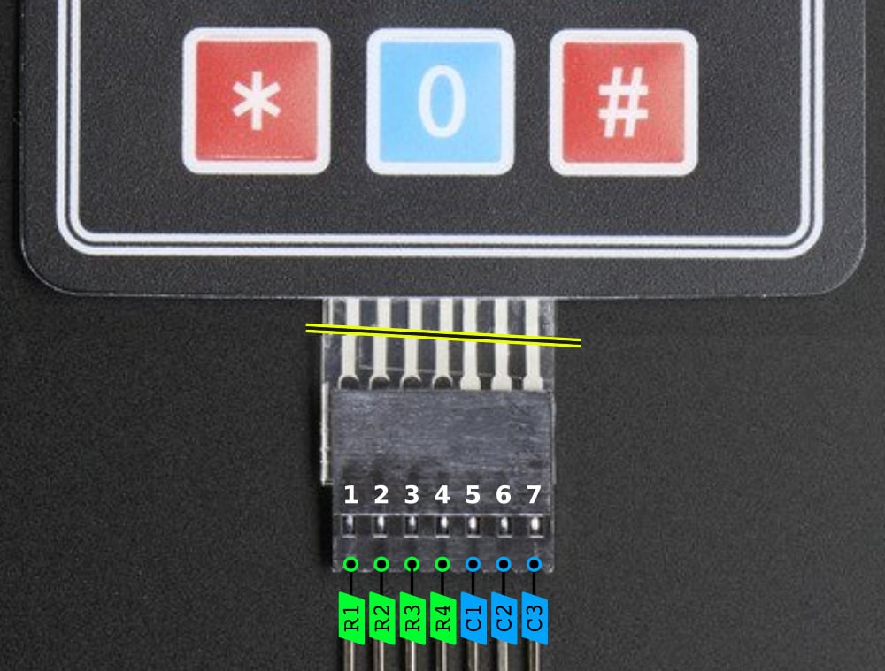
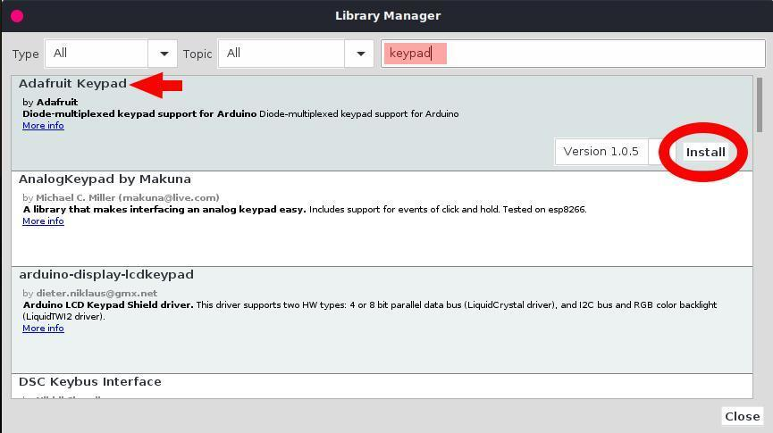

# Tutorial: Using an Adafruit 419 Membrane 3x4 Matrix Keypad

In this lesson, you will learn how to connect and program a 3x4 membrane matrix keypad using your Arduino and the Adafruit Keypad library to detect button presses.

## Objectives
* Understand how a matrix keypad saves digital pins by using a grid system.
* Learn how to install and use third-party libraries using the Arduino Library Manager.
* Program the Arduino to read and display key presses on the Serial Monitor.

## Materials Needed
* 1x Arduino Board
* 1x USB Cable
* Jumper Wires
* 1x Adafruit 419 Membrane 3x4 Matrix Keypad

## Component Review

A membrane matrix keypad allows you to add user input to your projects, like a security code or a calculator interface. The Adafruit 419 is a 3x4 matrix, meaning it has 12 buttons total (0-9, *, and #). 

If every button had its own dedicated pin, you would need 12 digital pins on your Arduino just to read this keypad! Instead, the buttons are arranged in a "matrix" of rows and columns. When you press a button, it connects one specific row to one specific column. By rapidly pulsing the rows and listening on the columns, the Arduino can figure out exactly which button is pressed using only 7 pins (4 rows + 3 columns).
<!-- 
 
-->



## Circuit Diagrams
Here are the visual references for building this circuit. Use the wiring diagram to see the physical layout on the breadboard, and use the schematic to understand the electrical flow.

### Schematic Diagram


### Wiring Diagram


## Hardware Setup
The Adafruit 419 keypad has a 7-pin connector. Looking at the front of the keypad, the pins from left to right are: Row 1, Row 2, Row 3, Row 4, Column 1, Column 2, Column 3.

1. **Connect the Rows:** Connect the first 4 pins (starting from the left) to Arduino Digital Pins **9, 8, 7, and 6**.
2. **Connect the Columns:** Connect the last 3 pins to Arduino Digital Pins **5, 4, and 3**.

## Library Installation
Before we write the code, we need to install the **Adafruit Keypad** library, which does all the heavy lifting of scanning the rows and columns for us.

1. Open the Arduino IDE.
2. Go to **Sketch** > **Include Library** > **Manage Libraries...** (or click the Library icon on the left sidebar in IDE 2.0+).
3. In the search bar, type `Adafruit Keypad`.
4. Find the library titled **Adafruit Keypad** by Adafruit and click **Install**.



## The Code
Open the Arduino IDE, delete any existing code, and copy the following into the editor:

```cpp
// Include the newly installed Adafruit Keypad library
#include "Adafruit_Keypad.h"

// Define the matrix dimensions
const byte ROWS = 4; // 4 rows
const byte COLS = 3; // 3 columns

// Define the physical layout of the buttons
char keys[ROWS][COLS] = {
  {'1','2','3'},
  {'4','5','6'},
  {'7','8','9'},
  {'*','0','#'}
};

// Define which Arduino pins are connected to the rows and columns
byte rowPins[ROWS] = {9, 8, 7, 6}; // Row 1 to Row 4
byte colPins[COLS] = {5, 4, 3};    // Col 1 to Col 3

// Initialize an instance of the keypad
Adafruit_Keypad customKeypad = Adafruit_Keypad( makeKeymap(keys), rowPins, colPins, ROWS, COLS);

void setup() {
  Serial.begin(9600);
  
  // Start the keypad
  customKeypad.begin();
  Serial.println("Keypad Initialized. Press any key!");
}

void loop() {
  // Update the keypad state (must be called repeatedly)
  customKeypad.tick();

  // Check if there is a new keypad event (button pressed or released)
  while(customKeypad.available()){
    keypadEvent e = customKeypad.read();
    
    // Print the character of the key
    Serial.print((char)e.bit.KEY);
    
    // Check if it was pressed or released and print the action
    if(e.bit.EVENT == KEY_JUST_PRESSED) {
      Serial.println(" pressed");
    }
    else if(e.bit.EVENT == KEY_JUST_RELEASED) {
      Serial.println(" released");
    }
  }
  
  delay(10); // Small delay for stability
}
```

Understanding the Code
* `#include "Adafruit_Keypad.h"`: This imports the library we installed, allowing us to use its built-in functions.
* `char keys[ROWS][COLS]`: This is a 2D array (a grid). It acts as a map that tells the Arduino which character corresponds to which physical button on the matrix. If you wire the keypad backward, you can easily fix it by rearranging these characters instead of changing your physical wires.
* `customKeypad.begin()`: Called in `setup()`, this initializes the pins behind the scenes, setting the row pins as outputs and column pins as inputs with pull-up resistors.
* `customKeypad.tick()`: This function does the actual work of scanning the keypad grid. It must be placed in `loop()` so it is called continuously.
* `customKeypad.available()` & `customKeypad.read()`: These check if a user has interacted with the keypad. If an event happened (a press or release), it reads the event into the variable `e`.
* `e.bit.KEY` and `e.bit.EVENT`: These properties of the event tell us exactly which key was pressed (referencing our `char keys` array) and what happened to it (was it just pressed down, or just released?).