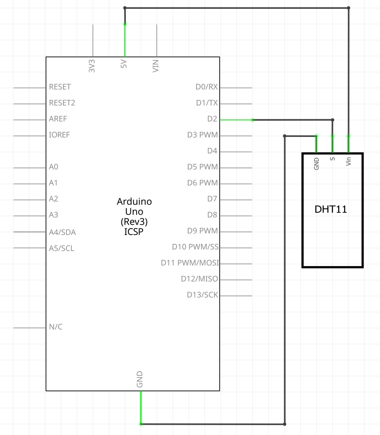
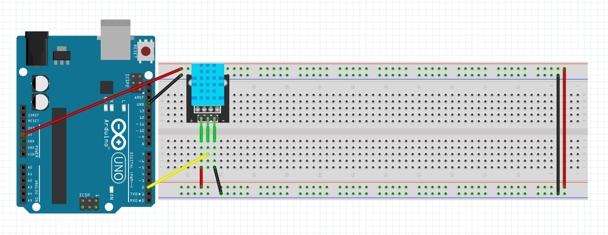

# Tutorial: Measuring Temperature and Humidity with a DHT11 Module

In this lesson, you will learn how to connect and program a DHT11 module to measure ambient temperature and humidity using your Arduino. We will explore a basic approach using `delay()`, and a more advanced "non-blocking" approach using the `millis()` function.

## Objectives
* Understand how the DHT11 sensor measures temperature and humidity.
* Learn how to install and use the Adafruit DHT sensor library.
* Display environmental readings in real-time on the Serial Monitor.
* Learn how to read sensors without halting the rest of your program using `millis()`.

## Materials Needed
* 1x Arduino Board
* 1x USB Cable
* Jumper Wires
* 1x Breadboard
* 1x DHT11 Temperature and Humidity Module


## Component Review

The DHT11 is a basic, ultra-low-cost digital temperature and humidity sensor. It uses a capacitive humidity sensor and a thermistor to measure the surrounding air, and outputs a digital signal on its data pin.

One of the main advantages of the DHT11 is its simplicity and low cost. While its communication protocol is somewhat complex, we can use a pre-written Arduino library to handle the precise timing required to read the data automatically.

**DHT11 Specifications:**
* **Operating Voltage:** 3.3V to 5V
* **Humidity Range:** 20% to 80% with ±5% accuracy
* **Temperature Range:** 0°C to 50°C with ±2°C accuracy
* **Sampling Rate:** 1 Hz (can only take one reading every second)

*(Note: A DHT11 "module" usually has 3 pins and a built-in pull-up resistor. A bare DHT11 sensor has 4 pins and requires you to add your own 10k Ohm resistor between the VCC and Data pins).*

## Circuit Diagrams

Here are the visual references for building this circuit. Use the wiring diagram to see the physical layout on the breadboard, and use the schematic to understand the electrical flow.

### Schematic Diagram


### Wiring Diagram


## Hardware Setup
The DHT11 module typically has 3 pins: VCC (+), GND (-), and DATA (out).
1. **Power:** Connect the **VCC** (or +) pin on the DHT11 module to the **5V** pin on the Arduino.
2. **Ground:** Connect the **GND** (or -) pin on the module to any **GND** pin on the Arduino.
3. **Signal:** Connect the **DATA** (or out) pin to **Digital Pin 2** on the Arduino.

## Library Installation
Before writing the code, you need to install the required library to easily communicate with the sensor.
1. Open the Arduino IDE.
2. Go to **Sketch** > **Include Library** > **Manage Libraries...**
3. In the search bar, type `DHT sensor library`.
4. Find the **DHT sensor library** by Adafruit and click **Install**.
*(Note: You may be prompted to install a dependency called the **Adafruit Unified Sensor** library. If so, click "Install All").*

---

## Example 1: Basic Code (Blocking)
Open the Arduino IDE, delete any existing code, and copy the following into the editor:

```cpp
// Include the DHT library
#include "DHT.h"

// The pin the DHT11 data pin is connected to
const int dhtPin = 2;     

// The type of DHT sensor we are using
const int dhtType = DHT11;   

// Initialize the DHT sensor object
DHT dht(dhtPin, dhtType);

void setup() {
  // Start the serial monitor
  Serial.begin(9600);
  Serial.println("DHT11 Sensor Test!");

  // Start the DHT sensor
  dht.begin();
}

void loop() {
  // The DHT11 is a slow sensor. Wait 2 seconds between measurements.
  delay(2000);

  // Read humidity as a percentage
  float humidity = dht.readHumidity();
  
  // Read temperature as Celsius
  float tempC = dht.readTemperature();
  
  // Read temperature as Fahrenheit (isFahrenheit = true)
  float tempF = dht.readTemperature(true);

  // Check if any reads failed and exit early (to try again)
  if (isnan(humidity) || isnan(tempC) || isnan(tempF)) {
    Serial.println("Failed to read from DHT sensor!");
    return;
  }

  // Print the results to the Serial Monitor
  Serial.print("Humidity: ");
  Serial.print(humidity);
  Serial.print("%  |  ");
  Serial.print("Temperature: ");
  Serial.print(tempC);
  Serial.print("°C / ");
  Serial.print(tempF);
  Serial.println("°F");
}
```

### Understanding the Basic Code

* **`#include "DHT.h"`**: This imports the Adafruit DHT library, which manages the complex timing required to read the digital signal from the DHT11 sensor behind the scenes.
* **`const int dhtPin = 2;` and `const int dhtType = DHT11;`**: These create constants to tell the library which pin the sensor is connected to and which specific model of sensor we are using. Using `const int` is safer and cleaner than using older `#define` preprocessor macros.
* **`DHT dht(dhtPin, dhtType);`**: This creates an object named `dht` that we will use to interact with our sensor in the code.
* **`dht.begin();`**: Called in the `setup()` block, this initializes the sensor and prepares it to take environmental readings.
* **`delay(2000);`**: The DHT11 is a slow sensor that needs time to process new data. We pause the loop for 2 seconds to ensure we get a stable, updated reading. However, this is "blocking" code, meaning the Arduino does absolutely nothing else for those 2 seconds.
* **`dht.readHumidity()` and `dht.readTemperature()`**: These functions request the current data from the sensor. Passing `true` into the temperature function tells it to automatically convert the result to Fahrenheit.
* **`isnan()`**: This stands for "Is Not a Number". If the Arduino fails to get a valid reading from the sensor, this statement catches the error and prints a warning message instead of displaying garbage data.

---

## Example 2: Advanced Code (Non-Blocking with `millis()`)
Using `delay(2000)` is fine for simple sketches, but what if you wanted your Arduino to constantly check for a button press or blink an LED while waiting for the DHT11 to be ready? The `delay()` function stops everything. 

Here is how to do the exact same thing without halting the rest of your code:

```cpp
// Include the DHT library
#include "DHT.h"

const int dhtPin = 2;     
const int dhtType = DHT11;   

DHT dht(dhtPin, dhtType);

// Variables for non-blocking delay
unsigned long previousMillis = 0;   // Stores the last time the sensor was updated
const long interval = 2000;         // Interval at which to read sensor (milliseconds)

void setup() {
  Serial.begin(9600);
  Serial.println("DHT11 Sensor Test - Non-Blocking!");
  dht.begin();
}

void loop() {
  // Capture the current time that the Arduino has been running
  unsigned long currentMillis = millis();

  // Check if 2000 milliseconds have passed since our last reading
  if (currentMillis - previousMillis >= interval) {
    
    // Save the last time you read the sensor
    previousMillis = currentMillis;

    // Read humidity and temperature
    float humidity = dht.readHumidity();
    float tempC = dht.readTemperature();
    float tempF = dht.readTemperature(true);

    // Check if any reads failed
    if (isnan(humidity) || isnan(tempC) || isnan(tempF)) {
      Serial.println("Failed to read from DHT sensor!");
    } else {
      // Print the results to the Serial Monitor
      Serial.print("Humidity: ");
      Serial.print(humidity);
      Serial.print("%  |  Temperature: ");
      Serial.print(tempC);
      Serial.print("°C / ");
      Serial.print(tempF);
      Serial.println("°F");
    }
  }

  // --> ANY OTHER CODE GOES HERE <--
  // Because we didn't use delay(), the Arduino races through the loop() 
  // thousands of times per second. You could add code here to check a 
  // button state or run a motor, and it would be immediately responsive.
}
```

### Understanding the Non-Blocking Code

* **`millis()`**: This built-in function returns the number of milliseconds the Arduino board has been running the current program. It acts as a constantly running stopwatch.
* **`unsigned long previousMillis = 0;`**: We create a variable to act as a "bookmark" to remember the exact time we last checked the sensor. We use `unsigned long` because `millis()` gets very large very quickly and standard `int` variables cannot hold a number that large.
* **`const long interval = 2000;`**: This defines our wait time (2 seconds).
* **The Logic (`if (currentMillis - previousMillis >= interval)`)**: 
    1. First, we check the current time on the stopwatch (`currentMillis`).
    2. We subtract the last time we checked the sensor (`previousMillis`).
    3. If the difference is greater than or equal to our 2000ms `interval`, it means 2 seconds have passed! 
    4. We step into the `if` statement, immediately update our `previousMillis` bookmark to the current time, and then read the sensor.
    5. If 2 seconds have *not* passed, the Arduino simply skips over the `if` statement entirely and continues running the rest of the code in the `loop()`, ensuring your program never freezes.