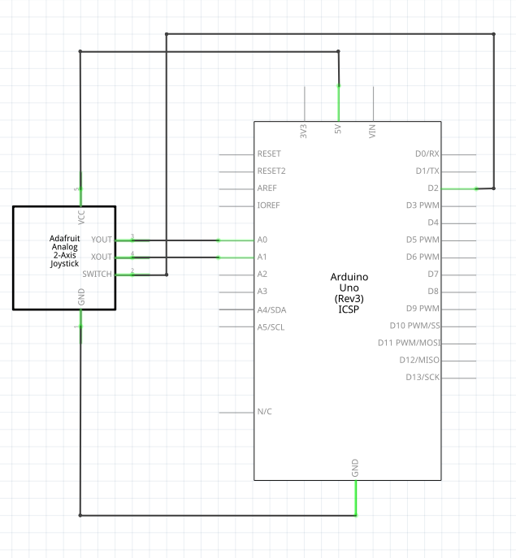

# Tutorial: Using a KY-023 Analog Joystick Module

In this lesson, you will learn how to connect and program a KY-023 analog joystick module using your Arduino. We will cover a basic approach to reading the joystick's movements, as well as an advanced method to handle "deadzones" for smoother, more reliable control in your projects.

## Objectives
* Understand how an analog joystick functions using dual potentiometers.
* Learn how to read analog signals (X and Y axes) and digital signals (the push button).
<!-- * Learn what a "deadzone" is and how to implement it in code to eliminate joystick drift. -->

## Materials Needed
* 1x Arduino Board
* 1x USB Cable
* Jumper Wires
* 1x Breadboard (optional)
* 1x KY-023 Analog Joystick Module

## Component Review

The KY-023 analog joystick is very similar to the thumbsticks found on standard video game console controllers. It provides 2-axis control (X and Y) and also features a built-in push button (Z-axis) that activates when you press down directly on the stick.

Internally, the joystick is essentially made of two 10k Ohm potentiometers (variable resistors) mounted at a 90-degree angle to one another. 
* When you move the stick left or right, it turns the X-axis potentiometer.
* When you move the stick up or down, it turns the Y-axis potentiometer.

Because they act as voltage dividers, the Arduino can use its analog pins to measure the changing voltage. The `analogRead()` function will return a value between **0 and 1023**. When the joystick is sitting still in its resting position, both the X and Y axes should read right around the middle: **512**.

## Circuit Diagrams

Here are the visual references for building this circuit. Use the wiring diagram to see the physical layout on the breadboard, and use the schematic to understand the electrical flow.

### Schematic Diagram

<!--
### Wiring Diagram

-->
## Hardware Setup
The KY-023 module has 5 pins: GND, +5V, VRx, VRy, and SW.
1. **Power:** Connect the **+5V** pin on the joystick to the **5V** pin on the Arduino.
2. **Ground:** Connect the **GND** pin on the joystick to any **GND** pin on the Arduino.
3. **X-Axis:** Connect the **VRx** (Variable Resistor X) pin to Arduino **Analog Pin A0**.
4. **Y-Axis:** Connect the **VRy** (Variable Resistor Y) pin to Arduino **Analog Pin A1**.
5. **Button:** Connect the **SW** (Switch) pin to Arduino **Digital Pin 2**.

---

## Example 1: Basic Joystick Code

Open the Arduino IDE, delete any existing code, and copy the following into the editor. This sketch simply reads the raw values of the joystick and prints them to the Serial Monitor.

```cpp
// Constants for the joystick pins
const int joyXPin = A0;  // Analog pin for X-axis
const int joyYPin = A1;  // Analog pin for Y-axis
const int joyBtnPin = 2; // Digital pin for the button

void setup() {
  // Start the serial communication
  Serial.begin(9600);
  
  // Initialize the button pin as an input with the internal pull-up resistor
  pinMode(joyBtnPin, INPUT_PULLUP);
  
  Serial.println("Basic Joystick Test Started!");
}

void loop() {
  // Read the analog values from the X and Y axes (ranges from 0 to 1023)
  int xValue = analogRead(joyXPin);
  int yValue = analogRead(joyYPin);
  
  // Read the state of the button
  int btnState = digitalRead(joyBtnPin);

  // Print the results to the Serial Monitor
  Serial.print("X: ");
  Serial.print(xValue);
  Serial.print(" | Y: ");
  Serial.print(yValue);
  
  // Since we use INPUT_PULLUP, a pressed button reads LOW (0)
  Serial.print(" | Button: ");
  if (btnState == LOW) {
    Serial.println("PRESSED");
  } else {
    Serial.println("Unpressed");
  }

  // Small delay to make the Serial Monitor readable
  delay(100);
}
```

### Understanding the Basic Code

* **`analogRead(joyXPin)`**: This reads the voltage on the analog pins (A0 and A1) and converts it into an integer from 0 to 1023. At rest, it will be around 512. Pushed fully one way, it will approach 0; pushed fully the other way, it will approach 1023.
* **`pinMode(joyBtnPin, INPUT_PULLUP)`**: We use the Arduino's internal pull-up resistor for the switch. This keeps the pin securely `HIGH` when the button is not pressed. When pressed, the switch connects to ground, causing the pin to read `LOW`.

---
<!-- 
## Example 2: Advanced Code (Handling Deadzones)

If you monitor the raw values from Example 1 closely, you will notice that when you let go of the joystick, it rarely snaps back exactly to 512. It might sit at 508, 515, or fluctuate slightly. In a robotics or gaming project, these slight fluctuations can cause unwanted movement or "drift". 

To fix this, we implement a **deadzone**: a small range around the center point where we tell the Arduino to completely ignore minor inputs. 

```cpp
// Constants for the joystick pins
const int joyXPin = A0;
const int joyYPin = A1;
const int joyBtnPin = 2;

// Deadzone configuration constants
const int centerValue = 512; // Ideal resting point
const int deadzone = 30;     // Fluctuation margin to ignore

void setup() {
  Serial.begin(9600);
  pinMode(joyBtnPin, INPUT_PULLUP);
  Serial.println("Advanced Joystick Test (With Deadzones) Started!");
}

void loop() {
  int rawX = analogRead(joyXPin);
  int rawY = analogRead(joyYPin);
  int btnState = digitalRead(joyBtnPin);

  // Variables to hold our processed and mapped values
  int mappedX = 0;
  int mappedY = 0;

  // Process X-Axis with Deadzone
  if (rawX > (centerValue + deadzone)) {
    // Stick pushed up/right beyond the deadzone
    mappedX = map(rawX, centerValue + deadzone, 1023, 0, 100);
  } 
  else if (rawX < (centerValue - deadzone)) {
    // Stick pushed down/left beyond the deadzone
    mappedX = map(rawX, centerValue - deadzone, 0, 0, -100);
  }
  // If rawX is within the deadzone (e.g. 482 to 542), mappedX remains 0.

  // Process Y-Axis with Deadzone
  if (rawY > (centerValue + deadzone)) {
    mappedY = map(rawY, centerValue + deadzone, 1023, 0, 100);
  } 
  else if (rawY < (centerValue - deadzone)) {
    mappedY = map(rawY, centerValue - deadzone, 0, 0, -100);
  }

  // Print the cleaned, mapped outputs (-100 to 100 scale)
  Serial.print("Mapped X: ");
  Serial.print(mappedX);
  Serial.print(" | Mapped Y: ");
  Serial.println(mappedY);

  delay(100);
}
```

### Understanding the Advanced Code

* **`const int centerValue = 512;` and `const int deadzone = 30;`**: We define our ideal center, and establish a buffer of 30 units in either direction. This means any raw value between 482 and 542 is treated as "dead center" and ignored.
* **The `if / else if` logic**: We check if the raw sensor value has broken out of our deadzone threshold. If it hasn't, the code ignores it, leaving `mappedX` and `mappedY` cleanly at `0`.
* **`map(value, fromLow, fromHigh, toLow, toHigh)`**: Once the stick breaks out of the deadzone, we use the `map()` function to rescale the remaining joystick travel into a clean percentage scale from 0 to 100 (for moving right/up) or 0 to -100 (for moving left/down). This provides incredibly smooth and predictable data for controlling motors or servos!

-->