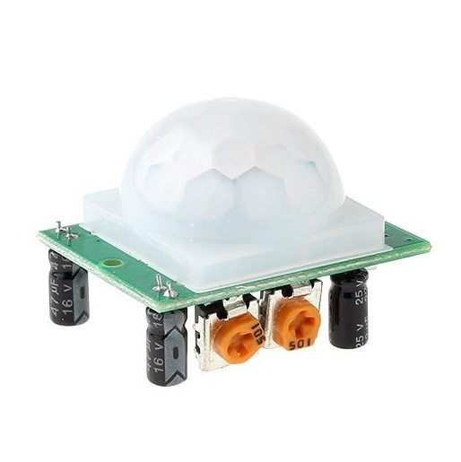
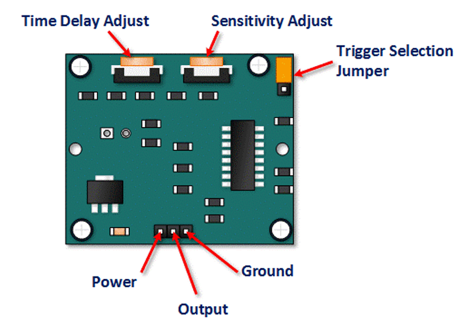
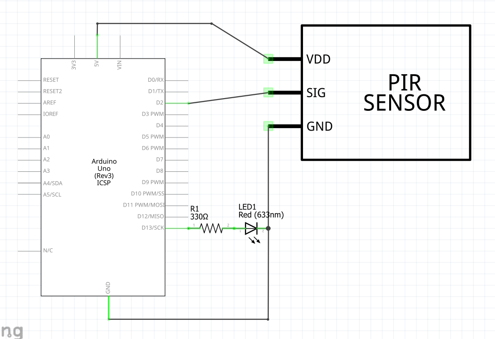
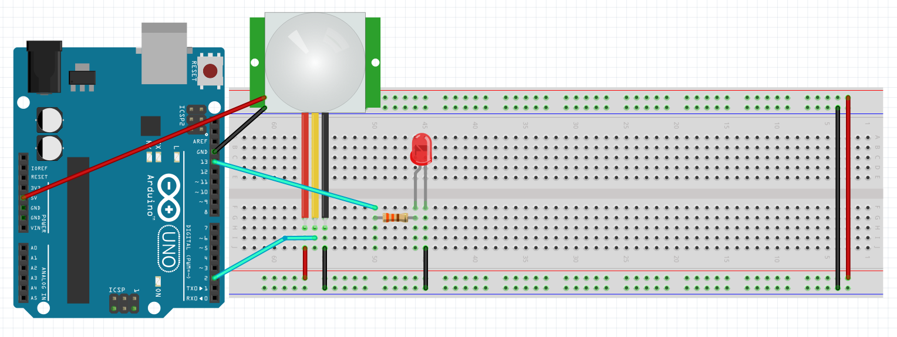

# Tutorial: Motion Detection with an HC-SR501 PIR Sensor

In this lesson, you will learn how to connect and program an HC-SR501 Passive Infrared (PIR) sensor to detect motion. We will also cover how to fine-tune the sensor's hardware using its built-in adjustment dials and trigger jumpers.




## Objectives
* Understand how PIR sensors detect movement using infrared heat signatures.
* Learn how to adjust the sensor's sensitivity and time delay dials.
* Understand the difference between Single and Repeatable trigger modes using the jumper.
* Write a program to detect motion, trigger an LED, and send a message to the Serial Monitor.

## Materials Needed
* 1x Arduino Board
* 1x USB Cable
* Jumper Wires
* 1x Breadboard
* 1x HC-SR501 PIR Sensor
* 1x 5mm LED (Optional, can use onboard LED on pin 13)
* 1x 330 Ohm Resistor (If using external LED)

## Component Review

The HC-SR501 is a Passive Infrared (PIR) sensor. Everything emits a certain amount of black body radiation in the form of heat; humans and animals emit a lot of it. A PIR sensor is split into two halves that are sensitive to this infrared heat. When a warm body passes in front of the sensor, it hits one half before the other, creating a positive differential change. The white plastic dome (a Fresnel lens) helps focus the infrared light onto the sensor.

### Hardware Adjustments: Dials and Jumpers
What makes the HC-SR501 exceptionally useful is that you can adjust its behavior mechanically without changing your Arduino code. If you flip the module over, you will see two orange potentiometers (dials) and a set of three pins with a jumper cap.



**1. The Adjustment Dials (Potentiometers)**
* **Sensitivity Dial (Distance):** This dial controls how far the sensor can "see." 
  * Turning it fully **clockwise** increases the range to its maximum (about 7 meters / 21 feet).
  * Turning it fully **counter-clockwise** decreases the range to its minimum (about 3 meters / 9 feet).
* **Time Delay Dial:** This dial controls how long the output pin stays `HIGH` (triggered) after motion is detected.
  * Turning it fully **clockwise** increases the delay to its maximum (about 5 minutes).
  * Turning it fully **counter-clockwise** decreases the delay to its minimum (about 3 seconds). *For testing your code, you should turn this all the way counter-clockwise!*

**2. The Trigger Mode Jumper**
There are three pins in the corner of the board with a small jumper cap connecting two of them. They are usually labeled **H** and **L**.
* **L - Single Trigger Mode:** When motion is detected, the sensor output goes `HIGH`. Once the Time Delay finishes running out, the output drops back to `LOW`, *even if the person is still moving in front of the sensor*. The sensor must reset to `LOW` before it can detect motion and go `HIGH` again.
* **H - Repeatable Trigger Mode (Default/Recommended):** When motion is detected, the sensor goes `HIGH`. However, every time it detects a *new* movement, the Time Delay resets. The sensor will only go `LOW` if no motion is detected for the entire duration of the time delay. This keeps your lights from turning off while you are still in the room!

## Circuit Diagrams

Here are the visual references for building this circuit. Use the wiring diagram to see the physical layout on the breadboard, and use the schematic to understand the electrical flow.

### Schematic Diagram


### Wiring Diagram


## Hardware Setup
Remove the plastic dome carefully if you need to read the pin labels underneath, but they are usually ordered as follows: VCC, OUT, GND.
1. **Power:** Connect the **VCC** pin of the PIR sensor to the **5V** pin on the Arduino.
2. **Ground:** Connect the **GND** pin of the PIR sensor to any **GND** pin on the Arduino.
3. **Signal:** Connect the middle **OUT** (Data) pin of the PIR sensor to **Digital Pin 2** on the Arduino.
4. **LED (Optional):** If using an external LED, connect its longer leg (anode) to **Digital Pin 13** and its shorter leg (cathode) through a 330 Ohm resistor to GND. *(Note: Arduino Uno has a built-in LED on Pin 13).*

## The Code
Open the Arduino IDE, delete any existing code, and copy the following into the editor:

```cpp
// Define the pins for the PIR sensor and the LED
const int pirPin = 2;    
const int ledPin = 13;   

// Variables to keep track of the sensor state
int pirState = LOW;      // Start assuming no motion is detected
int val = 0;             // Variable to read the pin status

void setup() {
  pinMode(ledPin, OUTPUT);  // Initialize LED as an output
  pinMode(pirPin, INPUT);   // Initialize PIR sensor as an input
  
  Serial.begin(9600);       // Start the Serial Monitor

  // PIR sensors need about 10-60 seconds to "warm up" and calibrate 
  // to the infrared signature of the room.
  Serial.println("Calibrating PIR Sensor...");
  delay(15000); // 15 second delay for calibration
  Serial.println("Sensor Active! Waiting for motion...");
}

void loop() {
  val = digitalRead(pirPin);  // Read the state of the PIR sensor

  // If the sensor is triggered (HIGH)
  if (val == HIGH) {            
    digitalWrite(ledPin, HIGH); // Turn the LED ON

    // We only want to print to the serial monitor ONCE when motion starts
    if (pirState == LOW) {
      Serial.println("Motion detected!");
      pirState = HIGH; // Update the current state
    }
  } 
  // If the sensor is quiet (LOW)
  else {
    digitalWrite(ledPin, LOW); // Turn the LED OFF

    // We only want to print ONCE when motion stops
    if (pirState == HIGH) {
      Serial.println("Motion ended.");
      pirState = LOW; // Update the current state
    }
  }
}
```

## Understanding the Code

* **Calibration Delay:** When a PIR sensor first receives power, it needs to take a "snapshot" of the ambient infrared heat in the room so it knows what "normal" looks like. In the `setup()` function, we included a `delay(15000);` to wait 15 seconds before the loop starts. If you don't do this, the sensor might trigger randomly for the first minute.
* **`val = digitalRead(pirPin);`**: The PIR sensor does all the heavy lifting using its onboard chip. It simply outputs a digital `HIGH` (5V) when it sees motion, and a `LOW` (0V) when it doesn't. We read this state into the `val` variable.
* **State Change Tracking (`pirState`)**: Notice how the code checks `if (pirState == LOW)` *inside* the main `if (val == HIGH)` block. The Arduino loop runs thousands of times a second. If we just wrote `Serial.println("Motion detected!")`, the Serial Monitor would be flooded with thousands of identical messages. By tracking the `pirState`, we only print the message exactly when the state *changes* from no motion to motion, and vice versa.

## Blocking Code
The example given above is **blocking**, which means the entire arduino program waits until the PIR sensor is ready.  See [Lesson 12 DHT11](/Lessons/12%20DHT11%20Temperature%20and%20Humidity%20Sensor) for an example of how to write non-blocking code.